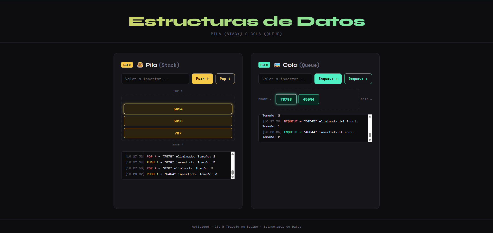

# 📚 Pila & Cola — Estructuras de Datos



> Actividad colaborativa de implementación de estructuras de datos con interfaz web.  
> Énfasis en el uso adecuado de **Git** y trabajo en equipo.

---

## 🌐 Demo

Abrir `index.html` en el navegador. No requiere servidor ni instalación adicional.

---

## 🎯 Descripción del Proyecto

Aplicación web interactiva que permite al usuario visualizar y manipular dos estructuras de datos fundamentales:

| Estructura | Política | Operaciones |
|-----------|----------|-------------|
| **Pila (Stack)** | LIFO — Last In, First Out | `push` / `pop` |
| **Cola (Queue)** | FIFO — First In, First Out | `enqueue` / `dequeue` |

---

## 👥 Roles del Equipo

### 🎨 Integrante A — Interfaz (HTML / CSS / UI)
**Archivo responsable:** `index.html`, `styles.css`, `ui.js`

- Diseño y maquetación de la interfaz web.
- Estilos visuales (paleta de colores, tipografía, animaciones).
- Función de renderizado para Pila y Cola (`renderStack`, `renderQueue`).
- Manejo de eventos del DOM (botones, inputs, teclado).
- Historial de operaciones (log) en pantalla.

### 🥞 Integrante B — Lógica de la Pila
**Archivo responsable:** `stack.js`

- Implementación de la clase `Stack`.
- Métodos: `push(value)`, `pop()`, `peek()`, `isEmpty()`, `size()`, `toArray()`.
- Documentación JSDoc de cada método.
- Instancia global `stack` utilizada por la interfaz.

### 🚌 Integrante C — Lógica de la Cola
**Archivo responsable:** `queue.js`

- Implementación de la clase `Queue`.
- Métodos: `enqueue(value)`, `dequeue()`, `front()`, `isEmpty()`, `size()`, `toArray()`.
- Documentación JSDoc de cada método.
- Instancia global `queue` utilizada por la interfaz.

---

## 📁 Estructura de Archivos

```
proyecto/
├── index.html    # Estructura HTML (Integrante A)
├── styles.css    # Estilos CSS (Integrante A)
├── ui.js         # Controlador de interfaz DOM (Integrante A)
├── stack.js      # Clase Stack — lógica pila (Integrante B)
├── queue.js      # Clase Queue — lógica cola (Integrante C)
└── README.md     # Documentación del proyecto
```

---

## ⚙️ Funcionalidades

### Pila (Stack)
- ✅ **Push:** inserta un elemento en el tope.
- ✅ **Pop:** elimina el elemento del tope.
- ✅ Visualización vertical (tope arriba, base abajo).
- ✅ El nodo del tope se resalta visualmente.
- ✅ Animación al insertar y eliminar.
- ✅ Mensajes de error si la pila está vacía.

### Cola (Queue)
- ✅ **Enqueue:** inserta un elemento al final (rear).
- ✅ **Dequeue:** elimina el elemento del frente (front).
- ✅ Visualización horizontal (front izquierda, rear derecha).
- ✅ El nodo del frente se resalta visualmente.
- ✅ Animación al insertar y eliminar.
- ✅ Mensajes de error si la cola está vacía.

---

## 🔀 Guía de Git — División de Commits

A continuación se describe cómo debería verse el historial de commits. **Cada integrante trabaja en su propia rama** y luego se hace merge a `main`.

### Flujo de trabajo sugerido

```bash
# 1. Clonar el repositorio
git clone https://github.com/usuario/repo-nombre.git
cd repo-nombre

# 2. Cada integrante crea su rama
git checkout -b feature/interfaz        # Integrante A
git checkout -b feature/logica-pila     # Integrante B
git checkout -b feature/logica-cola     # Integrante C

# 3. Trabajar en los archivos correspondientes
# ... editar archivos ...

# 4. Agregar y commitear cambios
git add archivo.js
git commit -m "feat: descripción del cambio"

# 5. Subir la rama al repositorio remoto
git push origin feature/mi-rama

# 6. Abrir un Pull Request en GitHub y hacer merge a main
```

### Commits recomendados por integrante

**Integrante A:**
```
feat(ui): crear estructura HTML base con secciones de pila y cola
feat(ui): agregar estilos CSS con variables y diseño responsive
feat(ui): implementar renderStack y renderQueue en ui.js
feat(ui): agregar animaciones de entrada y salida de nodos
feat(ui): implementar log de historial de operaciones
```

**Integrante B:**
```
feat(stack): crear clase Stack con arreglo interno
feat(stack): implementar método push
feat(stack): implementar método pop con validación
feat(stack): agregar métodos peek, isEmpty, size y toArray
feat(stack): documentar clase con JSDoc
```

**Integrante C:**
```
feat(queue): crear clase Queue con arreglo interno
feat(queue): implementar método enqueue
feat(queue): implementar método dequeue con validación
feat(queue): agregar métodos front, isEmpty, size y toArray
feat(queue): documentar clase con JSDoc
```

---

## 🧪 Cómo probar

1. Abrir `index.html` en cualquier navegador moderno.
2. En la sección **Pila**: escribir un valor y presionar **Push ↑** (o Enter).  
   Para eliminar, presionar **Pop ↓**.
3. En la sección **Cola**: escribir un valor y presionar **Enqueue →** (o Enter).  
   Para eliminar, presionar **Dequeue ←**.
4. El historial de operaciones se actualiza en tiempo real debajo de cada estructura.

---

## 📐 Conceptos Implementados

**Pila (Stack) — LIFO:**
```
push(C)  →  [ A | B | C ]  ← tope
pop()    →  [ A | B ]      ← C fue eliminado
```

**Cola (Queue) — FIFO:**
```
enqueue(C)  →  front → [ A | B | C ] → rear
dequeue()   →  front → [ B | C ]     → rear  (A fue eliminado)
```

---

## 👩‍💻 Tecnologías

- HTML5 semántico
- CSS3 (variables, animaciones, grid, flexbox)
- JavaScript ES6+ (clases, arrow functions, destructuring)
- Sin dependencias externas ni frameworks

---

*Actividad — Estructuras de Datos · Git & Trabajo en Equipo*
